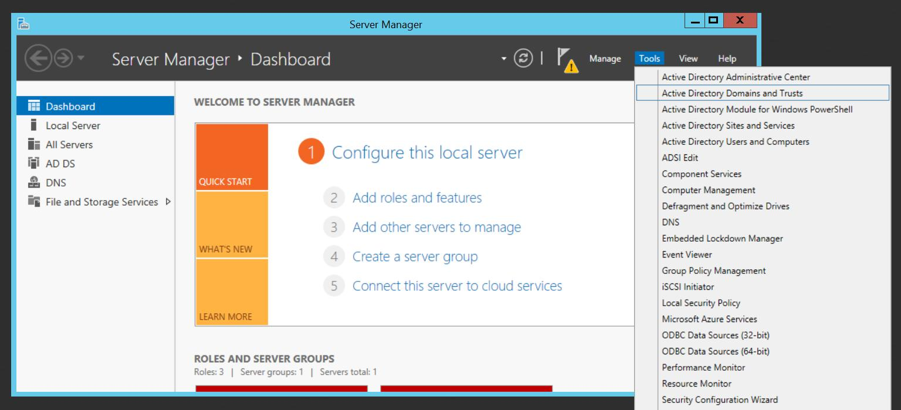
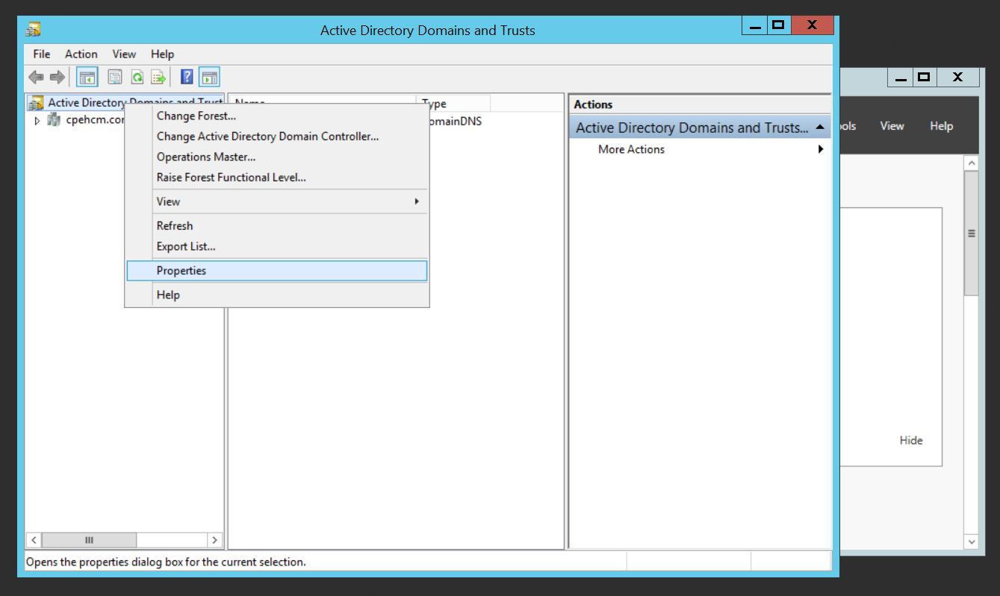
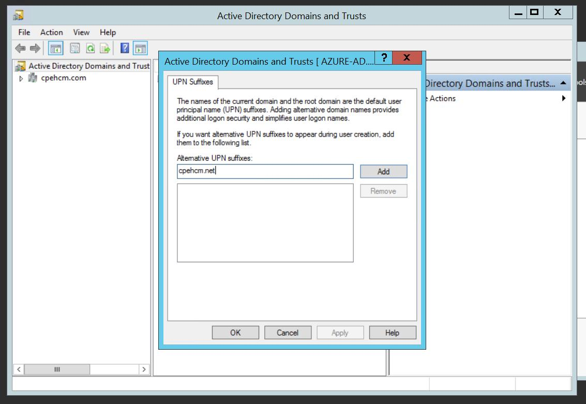
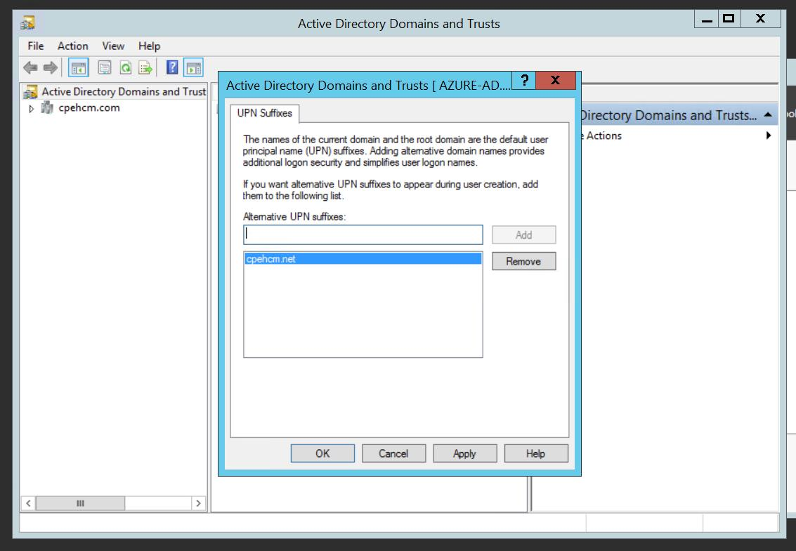
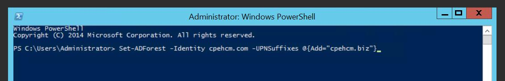
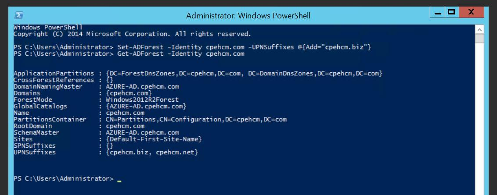
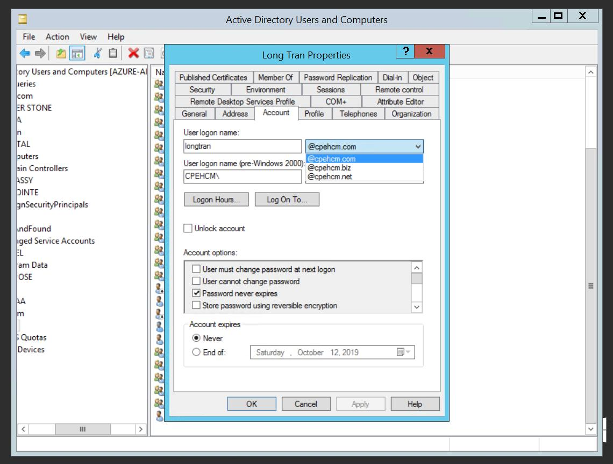

## TRAINING & CERTIFICATION
### Training
- [AZ-103: Microsoft Azure Administrator](#MicrosoftAzureAdministrator)
### Certification
- [Microsoft Certified Trainer (MCT)](https://www.youracclaim.com/badges/04991e21-b69a-41f6-aff0-aeb32c3f4973)
- [Microsoft Certified Azure Solutions Architect Expert](https://www.youracclaim.com/badges/2063f663-8f9f-4c53-9312-2f4f89fa92d5)
- [Microsoft Certified Azure Administrator Associate](https://www.youracclaim.com/badges/6edefc0d-2403-4b33-aa93-0b4b8f2dc3c1)
- [Microsoft Certified Solutions Expert (MCSE) Cloud Platform and Infrastructure](https://www.youracclaim.com/badges/d86f6e1e-a855-41e4-b7f1-5638990264ab)
- [Microsoft Certified Solutions Associate (MCSA) Cloud Platform](https://www.youracclaim.com/badges/67926413-164c-4d0e-b4ec-91521235ab76)
- [Microsoft Certified Solutions Expert (MCSE) Productivity](https://www.youracclaim.com/badges/0f6a5eac-594f-4eb8-b159-740b659882a6)
- [Microsoft Certified Solutions Associate (MCSA) Office 365](https://www.youracclaim.com/badges/12892074-4727-40c5-8691-83078ffeb4a9)
- Microsoft Certified Professional (MCP)

## Microsoft experience
### [Create a UPN Suffix with GUI and Powershell](#Howtocreat_a_AUPNSuffix_on_ActiveDirectory)

# POSTS INFORMATIONS

<a name="Howtocreat_a_AUPNSuffix_on_ActiveDirectory"></a>
### [How to create a UPN Suffix on Active Directory](https://github.com/dakmedia/longtran.github.io/blob/master/Add-UPN-Suffix.md)
- [Create a UPN Suffix via GUI](#GUIUPN)
- [Create a UPN Suffix via Powershell](#PSGUI)

<a name="GUIUPN"></a>
#### Create a UPN Suffix via GUI
Step 1:  **Server Manager**, selete menu **Tools**, choose **Active Directory Domains and Trusts**

Step 2:  **Active Directory Domains and Trusts** right click choose **Properties**

Step 3: Type *UPN suffix* domain in Alternative UPN suffixes:

Step 4: Then **Apply**, **OK**.


<a name="PSUPN"></a>
#### Create a UPN Suffix via Powershell
Step 1: Run as Administrator, and type command:
```sh
Set-ADForest -Identity cpehcm.com -UPNSuffixes @{Add="cpehcm.biz"}
```

Step 2: List all UPN suffixes domain via Powershell command:
```sh
Get-ADForest | fl UPNSuffixes
```

Step 3: Change all users to new UPN suffix domain via Powershell, for example:
```sh
Get-ADForest | Set-ADForest -UPNSuffixes @{add="cpehcm.biz"}
```

Step 4: Change all users to new UPN suffix domain via GUI:


<a name="MicrosoftAzureAdministrator"></a>
## [AZ-103: Microsoft Azure Administrator](https://github.com/dakmedia/longtran.github.io/blob/master/Couse-Az103-ITFORVN.md)


### Manage Azure Subscriptions and Resources
#### Manage Azure Subscriptions
- Azure Deployment Models
- Assign Administrator Permissions
- Configure Cost Center Quotas and Tagging
- Configure Subscription Policies

#### Analyze Azure Utilization And Consumption
- Configure diagnostic settings on resources
- Create action groups
- Create and test alerts
- Monitor spend
- Utilize Log Search query functions
- View alerts in Log Analytics
- Spending

#### Manage Resource Groups
- Configure resource locks
- Move resources across resource groups
- Remove resource groups
- Lab - Azure Policies

#### Manage Role - Based Access Control (RBAC)
- Lab - Role Based Access Control
- Lab - Custom Roles

### Implement And Manage Storage
#### Create and Configure Storage accounts
- Create and configure storage account
- Configure network access to the storage account
- Generate shared access signature
- Install and use Azure Storage Explorer
- Manage access keys
- Implement Azure storage replication
- Lab - Activity Logs

#### Import and Export Data to Azure
- Create export from Azure job
- Create import from Azure job
- Configure and use Azure blob storage
- Configure Azure content delivery network (CDN) endpoints
- Azure Data Box

#### Configure Azure Files
- Create Azure file share
- Create Azure File Sync service
- Troubleshoot Azure File Sync

#### Implement Azure Backup
- Configure and review backup reports
- Perform backup operation
- Create Recovery Services Vault
- Create and configure backup policy
- Perform a restore operation

### Deploy And Manage Virtual Machine
#### Create and Configure a VM for Windows and Linux
- Create and Configure a Windows VM
- Configuring Monitoring, Networking, Storage and Virtual Machine size
- Configure Storage
- Configure High Availability
- Configure high availability - Availability Zone
- Deploy and Configure Scale Sets
- Lab - Building a Linux Virtual Machine

#### Automate Deployment of Virtual Machine
- Modify Azure Resource Manager(ARM) Template
- Deploy Windows and Linux VM's
- Save a Deployment As An ARM template

#### Manage Azure VM
- Add Data Discs
- Add network interfaces
- Automate configuration management by using PowerShell Desired State Configuration (DSC)
- Automate configuration management by using Custom Script Extension
- Move VMs from one resource group to another
- Redeploy VMs

#### Manage VM Backups
- Lab - Restore VM

#### Configure and Manage Virtual Networks
- Create Connectivity Between Virtual Networks
- Create and configure VNET to VNET
- Create and configure VNET peering

#### Implement and Manage Virtual Networking
- Configure private and public IP addresses
- Configure network routes
- Configure Network Interface
- Configure subnets, and virtual network

#### Configure Name Resolution
- Configure Private DNS Zones
- Lab - Azure DNS

#### Create and Configure a Network Security Group
- Create Network Security Group and Security Rules

#### Implement Azure Load Balancer
- Azure Load Balancer
- Lab - Azure Load Balancer

#### Monitor and Troubleshoot Virtual Networking
- Network Watcher
- Lab - Azure Network Watcher

#### Integrate On Premises network with Azure Virtual Network
- Hybrid Connections
- Lab - Point to Site VPN

### Manage Identities
#### Manage Azure Active Directory
- Overview of Azure AD
- Add custom domains
- Configure Azure AD Identity Protection
- Configure Azure AD Join
- Configure self-service password reset
- Implement Conditional Access policies
- Perform Access Review
- Managed multiple directories

#### Manage Azure AD Objects (Users,Groups and Devices)
- Create users and groups
- Manage User and Group Properties
- Manage Device Settings
- Perform Bulk User Updates

#### Implement and Manage Hybrid Identities
- Install and configure Azure AD Connect
- Configure Federation and Single Sign-On
- Manage password sync and writeback

### Lab Excercises (for you to get a certificate)
- Lab - Availability sets
- Lab - Azure DNS
- Lab - Load Balancer - SLA
- Lab - Network Security Groups
- Lab - Recovery Services vault
- Lab - Site-to-Site - VPN Gateway
- Lab - VNET peering
- Lab - Backup - Virtual Machines
- Lab - Storage Accounts - Virtual Machine Disks
- Lab - Storage Accounts - Secure Transfer
- Lab - Virtual Machines - Public IP
- Lab - Virtual Network Connectivity - Troubleshooting

### Read more: 
- [Exam AZ-103: Microsoft Azure Administrator](https://www.microsoft.com/en-us/learning/exam-az-103.aspx)
- [Microsoft Certified: Azure Administrator Associate](https://www.microsoft.com/en-us/learning/azure-administrator.aspx)
